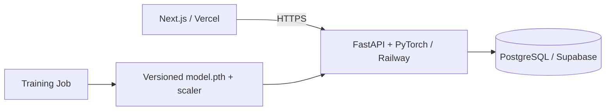

# 📈 AI-Driven Quantitative Trading System


全端量化交易與 AI 回測系統：**Next.js + FastAPI + PyTorch LSTM + PostgreSQL**。

## 🏗️ 架構



## 🚀 雲端部署：Vercel + Railway + Supabase

### Supabase PostgreSQL

建立 Supabase project，取得 PostgreSQL connection information，並把以下變數放到 Railway：

```text
DATABASE_URL=postgresql://postgres:<password>@<host>:5432/postgres
```

也可以使用 `DB_USER` / `DB_PASSWORD` / `DB_HOST` / `DB_PORT` / `DB_NAME` 五個變數。請先建立專案需要的 `Securities` 與 `Market_Data` schema。

### Railway API

將 GitHub repository 連到 Railway，Root Directory 保持 repository root，Railway 會依 `Dockerfile` 建置 FastAPI。

Production 建議設定：

```text
DATABASE_URL=...
CORS_ORIGINS=https://<your-vercel-domain>
MODEL_DIR=/app/models
```

如果使用 Railway Volume，將 volume mount 到 `/app/models`，讓重新部署後模型 artifact 仍保留。

健康檢查：

```text
https://<your-railway-domain>/health
https://<your-railway-domain>/health/db
```

### Vercel Next.js

Import Git Repository，Root Directory 選 `frontend`。

```text
NEXT_PUBLIC_API_URL=https://<your-railway-domain>
```

Build command：`npm run build`

### 第一次發布 LSTM 模型

API 現在是 **inference-only**，不會因使用者按一次回測就重新 train。

在 Railway service 執行一次 training command：

```bash
python scripts/train_lstm.py --ticker 2330.TW --start 2020-01-01 --end 2099-12-31 --epochs 30
```

成功後會產生 versioned：

```text
models/lstm_2330.TW_<version>.pth
models/lstm_2330.TW_<version>.scaler.pkl
models/registry.json
```

之後確認：

```text
https://<your-railway-domain>/health/model/2330.TW
```

應回傳目前 active model version。

### 新增股票模型

每一支股票可以獨立訓練並發布：

```bash
python scripts/train_lstm.py --ticker 2317.TW --epochs 30
```

`registry.json` 會記錄版本、ticker、features、epochs、training time 與 artifact path。

## 🧪 本機執行

### API

```bash
pip install -r requirements.txt
uvicorn api.main:app --reload --port 8000
```

### Training

```bash
python scripts/train_lstm.py --ticker 2330.TW --start 2020-01-01 --end 2099-12-31 --epochs 30
```

### Frontend

```bash
cd frontend
npm install
npm run dev
```

建立 `frontend/.env.local`：

```text
NEXT_PUBLIC_API_URL=http://localhost:8000
```

## 🤖 LSTM Production Workflow

```text
Training Job
    ↓
PostgreSQL historical data
    ↓
Feature engineering
    ↓
PyTorch LSTM training
    ↓
model.pth + fitted MinMaxScaler
    ↓
versioned registry
    ↓
FastAPI inference
    ↓
MA20 + Volume factor
    ↓
Backtest
```

模型仍使用既有 60 日 look-back 與 Return / Close / Volume / RSI 特徵；training scaler 會與模型一起保存，避免 inference 時重新 fit scaler。

## 🔐 Secrets

不要把 `.env`、Supabase password、Railway token、Vercel token 或模型 artifacts 提交到 Git。Repository 提供 `.env.example` 作為設定模板。
