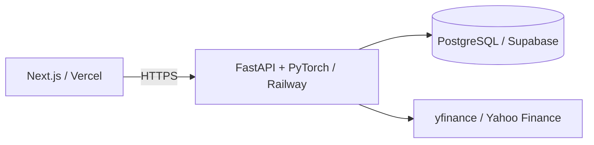

# 📈 AI-Driven Quantitative Trading System


全端量化交易與 AI 回測系統：**Next.js + FastAPI + PyTorch LSTM + PostgreSQL**。

## 🏗️ 架構



## 🚀 雲端部署：Vercel + Railway + Supabase

### 1. Supabase PostgreSQL

在 Supabase 建立 project，取得 PostgreSQL connection information。

把以下變數放到 Railway service：

```text
DB_USER=postgres
DB_PASSWORD=<Supabase DB password>
DB_HOST=<Supabase host>
DB_PORT=5432
DB_NAME=postgres
```

請先在 Supabase 執行專案原本的 SQL schema / migration，確認 `Securities` 與 `market_data` 已建立。

### 2. Railway API

將 GitHub repository 連到 Railway，服務 Root Directory 保持 repository root，Railway 會依 `Dockerfile` 建置 FastAPI。

需要設定：

```text
DB_USER
DB_PASSWORD
DB_HOST
DB_PORT
DB_NAME
```

Railway 會自動提供 `PORT`，不要把 `PORT` 寫死。

部署後確認：

```text
https://<your-railway-domain>/health
```

應回傳：

```json
{"status":"ok"}
```

### 3. Vercel Next.js

在 Vercel Import Git Repository，選擇 `frontend` 作為 **Root Directory**。

Build command：

```text
npm run build
```

Install command：

```text
npm install
```

設定環境變數：

```text
NEXT_PUBLIC_API_URL=https://<your-railway-domain>
```

部署完成後，Vercel 會提供前端網址。

### 4. Railway CORS

目前 FastAPI API 開放跨來源 request，方便 Vercel 與 Railway 分離部署。正式環境建議將 `api/main.py` 的 `allow_origins` 收窄為你的 Vercel domain。

## 🧪 本機執行

### API

```bash
pip install -r requirements.txt
uvicorn api.main:app --reload --port 8000
```

### Frontend

```bash
cd frontend
npm install
npm run dev
```

建立 `frontend/.env.local`：

```text
NEXT_PUBLIC_API_URL=http://localhost:8000
```

## 🤖 LSTM

API 使用專案既有 `model_core.py` 的 PyTorch LSTM，60 日 look-back，使用 Return / Close / Volume / RSI 特徵預測報酬率，再與 MA20 + 成交量因子組成進場訊號。

目前每次回測都會重新訓練模型。正式上線後建議把 training job 與 inference service 分離，保存 `.pth` 權重，降低 API response time。

## 🔐 Secrets

不要把 `.env`、Supabase password、Railway token、Vercel token 或模型私鑰提交到 Git。Repository 提供 `.env.example` 作為設定模板。
