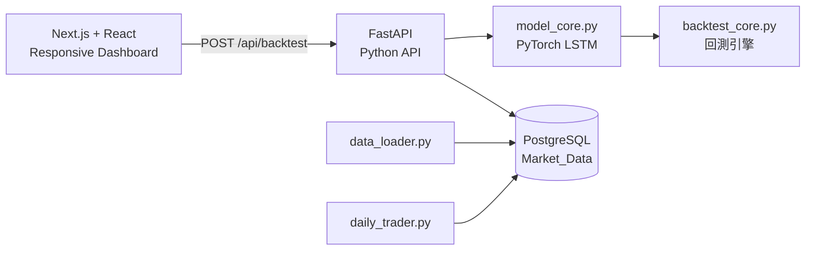

# 📈 AI-Driven Quantitative Trading System


## 📝 專案簡介

這是一套資料驅動的全端量化交易與回測系統。前端已由 Streamlit 升級為 **Next.js + React**，Python 則透過 **FastAPI** 提供回測 API；核心策略、PyTorch LSTM 與 PostgreSQL 資料層維持原有設計。

Dashboard 支援股票與日期範圍、初始本金、停損/停利、LSTM 訓練 Epoch、KPI、資金曲線、LSTM 預測報酬率、買賣點與交易日誌。

## 🏗️ 新架構



### 技術分層

1. **Presentation Layer** — `frontend/`
   - Next.js App Router、React、TypeScript、Recharts。
   - RWD Dashboard，取代原本的 Streamlit UI。
2. **API / Application Layer** — `api/main.py`
   - FastAPI 接收回測參數、查詢 PostgreSQL、建立模型特徵、訓練 LSTM、產生訊號，再呼叫核心回測引擎。
3. **Business Logic Layer** — `backtest_core.py`, `model_core.py`
   - `model_core.py` 使用 60 日 look-back，輸入 Return / Close / Volume / RSI，透過 PyTorch LSTM 預測下一期 Return。
   - LSTM 看漲預測再搭配 MA20 + 成交量因子作為雙因子進場條件。
4. **Data Layer** — PostgreSQL / SQLAlchemy / `data_loader.py`
   - 歷史市場資料集中由 PostgreSQL 管理。

## 🚀 快速啟動

### 1. Python API

```bash
pip install -r requirements.txt
uvicorn api.main:app --reload --port 8000
```

### 2. Next.js 前端

```bash
cd frontend
npm install
npm run dev
```

瀏覽器開啟 `http://localhost:3000`。

若 FastAPI 不是跑在 `http://localhost:8000`，可設定：

```bash
# frontend/.env.local
NEXT_PUBLIC_API_URL=http://localhost:8000
```

### 3. PostgreSQL

請確認 `.env` 已設定：

```text
DB_USER=...
DB_PASSWORD=...
DB_HOST=...
DB_PORT=5432
DB_NAME=quant_db
```

### 4. 單元測試

```bash
pytest unit_test.py
```

## 📂 專案結構

```text
├── api/
│   └── main.py            # FastAPI 回測 API
├── frontend/
│   ├── app/
│   │   ├── page.tsx       # Next.js Dashboard
│   │   ├── layout.tsx
│   │   └── globals.css
│   ├── package.json
│   ├── tsconfig.json
│   └── next-env.d.ts
├── data_loader.py         # ETL 與資料庫介接
├── model_core.py          # PyTorch LSTM 模型與特徵工程
├── backtest_core.py       # 回測引擎與績效結算
├── daily_trader.py        # 模擬實盤自動化下單
├── requirements.txt       # Python API / ML 依賴
└── unit_test.py            # Pytest 單元測試
```

## 🤖 LSTM 訊號流程

1. 從 PostgreSQL 取得指定股票歷史資料。
2. 計算 Return、MA20、成交量均線與 RSI。
3. 使用前 80% 序列 fit MinMaxScaler，避免資料洩漏。
4. 使用 60 個交易日建立 LSTM sequence。
5. 以訓練資料訓練 PyTorch LSTM。
6. 產生預測 Return；預測 Return > 0 視為 AI 看漲。
7. 再通過 `Close > MA20` 且 `Volume > Volume MA20` 的多因子濾網。
8. 將最終訊號交給 `backtest_core.py` 執行回測。

> 注意：目前 API 每次回測都會重新訓練模型。這適合展示與研究；正式部署建議把模型訓練與 API inference 分離，將訓練好的權重保存後直接載入推論。
